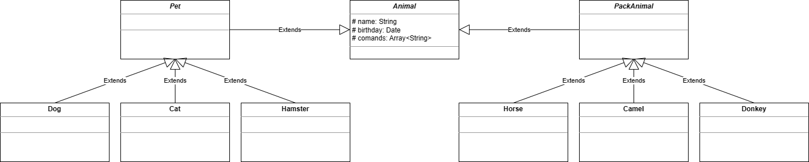

# animal_kennel_test

# __Итоговая аттестация__

## Задание 1
- Используя команду cat в терминале операционной системы Linux, создать
два файла: Домашние животные (заполнив файл собаками, кошками,
хомяками) и Вьючные животными заполнив файл Лошадьми, верблюдами и
ослы), а затем объединить их. Просмотреть содержимое созданного файла.
Переименовать файл, дав ему новое имя (Друзья человека).

_Список команд для выполнения задания:_
```
cat > Домашние_животные.txt
собаки, кошки, хомяки
(для сохранения и выхода нажать Ctrl+D)

cat > Вьючные_животные.txt
лошади, верблюды, ослы
(для сохранения и выхода нажать Ctrl+D)

cat Домашние_животные.txt Вьючные_животные.txt > test.txt

cat test.txt

mv test.txt Друзья_человека.txt
```
## Задание 2
- Создать директорию, переместить файл туда.

_Список команд для выполнения задания:_
```
mkdir Animals
mv Друзья_человека.txt Animals/
```
## Задание 3
-  Подключить дополнительный репозиторий MySQL. Установить любой пакет
из этого репозитория.

_Список команд для выполнения задания:_
```
wget https://dev.mysql.com/get/mysql-apt-config_0.8.24-1_all.deb
sudo dpkg -i mysql-apt-config_0.8.24-1_all.deb
sudo apt-get update
sudo apt-get install mysql-client
```
## Задание 4
- Установить и удалить deb-пакет с помощью dpkg.

_Список команд для выполнения задания:_
```
wget https://download.virtualbox.org/virtualbox/7.0.6/virtualbox-7.0_7.0.6-155176~Ubuntu~jammy_amd64.deb
sudo dpkg -i virtualbox-7.0_7.0.6-155176~Ubuntu~jammy_amd64.deb
sudo apt -f install
sudo dpkg -r virtualbox-7.0
```
## Задание 5
- Выложить историю команд в терминале ubuntu.

_Список команд для выполнения задания:_
```
history > commands.txt
```
После выполнения команды история команд будет записана в файл [commands.txt](/part1_linux/commands.txt)

## Задание 6
- Нарисовать диаграмму, в которой есть класс родительский класс, домашние
животные и вьючные животные, в составы которых в случае домашних
животных войдут классы: собаки, кошки, хомяки, а в класс вьючные животные
войдут: Лошади, верблюды и ослы).



## Задание 7
- В подключенном MySQL репозитории создать базу данных “Друзья
человека”.

_Список команд для выполнения задания:_
```
CREATE DATABASE human_friends;
```

## Задание 8
- Создать таблицы с иерархией из диаграммы в БД.

_Список команд для выполнения задания:_
```
USE human_friends;

CREATE TABLE `human_friends`.`animal` ( `id` INT(11) NOT NULL AUTO_INCREMENT , `pid` VARCHAR(100) NOT NULL , `name` VARCHAR(100) NOT NULL , `birthday` DATE NULL , `comands` JSON NULL , PRIMARY KEY (`id`)) ENGINE = InnoDB;
INSERT INTO `animal` (`id`, `pid`, `name`) VALUES (NULL, 'root', 'Животные');

CREATE TABLE `human_friends`.`pet` ( `id` INT(11) NOT NULL AUTO_INCREMENT , `pid` VARCHAR(100) NOT NULL , `name` VARCHAR(100) NOT NULL , PRIMARY KEY (`id`)) ENGINE = InnoDB;
INSERT INTO `pet` (`id`, `pid`, `name`) VALUES (NULL, 'animal', 'Домашние животные');

CREATE TABLE `human_friends`.`pack_animal` ( `id` INT(11) NOT NULL AUTO_INCREMENT , `pid` VARCHAR(100) NOT NULL , `name` VARCHAR(100) NOT NULL , PRIMARY KEY (`id`)) ENGINE = InnoDB;
INSERT INTO `pack_animal` (`id`, `pid`, `name`) VALUES (NULL, 'animal', 'Вьючные животные');

CREATE TABLE `human_friends`.`dog` ( `id` INT(11) NOT NULL AUTO_INCREMENT , `pid` VARCHAR(100) NOT NULL  , `name` VARCHAR(100) NOT NULL , `birthday` DATE NULL , `comands` JSON NULL , PRIMARY KEY (`id`)) ENGINE = InnoDB;

CREATE TABLE `human_friends`.`cat` ( `id` INT(11) NOT NULL AUTO_INCREMENT , `pid` VARCHAR(100) NOT NULL  , `name` VARCHAR(100) NOT NULL , `birthday` DATE NULL , `comands` JSON NULL , PRIMARY KEY (`id`)) ENGINE = InnoDB;

CREATE TABLE `human_friends`.`hamster` ( `id` INT(11) NOT NULL AUTO_INCREMENT , `pid` VARCHAR(100) NOT NULL  , `name` VARCHAR(100) NOT NULL , `birthday` DATE NULL , `comands` JSON NULL , PRIMARY KEY (`id`)) ENGINE = InnoDB;

CREATE TABLE `human_friends`.`horse` ( `id` INT(11) NOT NULL AUTO_INCREMENT , `pid` VARCHAR(100) NOT NULL  , `name` VARCHAR(100) NOT NULL , `birthday` DATE NULL , `comands` JSON NULL , PRIMARY KEY (`id`)) ENGINE = InnoDB;

CREATE TABLE `human_friends`.`camel` ( `id` INT(11) NOT NULL AUTO_INCREMENT , `pid` VARCHAR(100) NOT NULL  , `name` VARCHAR(100) NOT NULL , `birthday` DATE NULL , `comands` JSON NULL , PRIMARY KEY (`id`)) ENGINE = InnoDB;

CREATE TABLE `human_friends`.`donkey` ( `id` INT(11) NOT NULL AUTO_INCREMENT , `pid` VARCHAR(100) NOT NULL  , `name` VARCHAR(100) NOT NULL , `birthday` DATE NULL , `comands` JSON NULL , PRIMARY KEY (`id`)) ENGINE = InnoDB;
```

## Задание 9
- Заполнить низкоуровневые таблицы именами(животных), командами
которые они выполняют и датами рождения.

_Список команд для выполнения задания:_
```
INSERT INTO `dog` (`id`, `pid`, `name`, `birthday`, `comands`) VALUES (NULL, 'pet', 'Гром', '2019-11-25', NULL), (NULL, 'pet', 'Спарта', '2021-03-22', NULL);

INSERT INTO `cat` (`id`, `pid`, `name`, `birthday`, `comands`) VALUES (NULL, 'pet', 'Тайсон', '2017-09-11', NULL), (NULL, 'pet', 'Кокос', '201-10-20', NULL);

INSERT INTO `hamster` (`id`, `pid`, `name`, `birthday`, `comands`) VALUES (NULL, 'pet', 'Марсик', '2021-12-12', NULL), (NULL, 'pet', 'Пончик', '2022-10-10', NULL);

INSERT INTO `horse` (`id`, `pid`, `name`, `birthday`, `comands`) VALUES (NULL, 'pack_animal', 'Богатырь', '2013-09-03', '[\"Везти груз\"]'), (NULL, 'pack_animal', 'Камелия', '2017-11-22', '[\"Везти груз\"]');

INSERT INTO `camel` (`id`, `pid`, `name`, `birthday`, `comands`) VALUES (NULL, 'pack_animal', 'Ида', '2021-01-15', '[\"Везти груз\"]'), (NULL, 'pack_animal', 'Ланцелот', '2019-08-06', '[\"Везти груз\"]');

INSERT INTO `donkey` (`id`, `pid`, `name`, `birthday`, `comands`) VALUES (NULL, 'pack_animal', 'Нельсон', '2014-11-25', '[\"Везти груз\"]'), (NULL, 'pack_animal', 'Загреб', '2021-05-03', '[\"Везти груз\"]');
```

## Задание 10
- Удалить из таблицы верблюдов, т.к. верблюдов решили перевезти в другой
питомник на зимовку. Объединить таблицы лошади, и ослы в одну таблицу.

_Список команд для выполнения задания:_
```
DROP TABLE camel;

CREATE TABLE `human_friends`.`horse_and_donkey` AS SELECT pid, CASE WHEN pid = 'pack_animal' THEN 'horse' END AS pid1, name, birthday, comands FROM horse UNION select pid, CASE WHEN pid = 'pack_animal' THEN 'donkey' END AS pid1, name, birthday, comands FROM donkey;

ALTER TABLE horse_and_donkey ADD `id` INT NOT NULL AUTO_INCREMENT UNIQUE FIRST;

DROP TABLE horse;

DROP TABLE donkey;
```

## Задание 11
- Создать новую таблицу “молодые животные” в которую попадут все
животные старше 1 года, но младше 3 лет и в отдельном столбце с точностью
до месяца подсчитать возраст животных в новой таблице.

_Список команд для выполнения задания:_
```
CREATE TABLE `human_friends`.`young_animals` ( `id` INT(11) NOT NULL AUTO_INCREMENT , `pid` VARCHAR(100) NOT NULL , `pid1` VARCHAR(100) NOT NULL , `name` VARCHAR(100) NOT NULL , `birthday` DATE NULL , `comands` JSON NULL , PRIMARY KEY (`id`)) ENGINE = InnoDB;

INSERT INTO young_animals (pid, pid1, name, birthday, comands) SELECT pid, CASE WHEN pid = 'pet' THEN 'dog' END AS pid1, name, birthday, comands FROM dog WHERE birthday BETWEEN DATE_SUB(CURDATE(),INTERVAL 3 YEAR) AND CURDATE();

INSERT INTO young_animals (pid, pid1, name, birthday, comands) SELECT pid, CASE WHEN pid = 'pet' THEN 'cat' END AS pid1, name, birthday, comands FROM cat WHERE birthday BETWEEN DATE_SUB(CURDATE(),INTERVAL 3 YEAR) AND CURDATE();

INSERT INTO young_animals (pid, pid1, name, birthday, comands) SELECT pid, CASE WHEN pid = 'pet' THEN 'hamster' END AS pid1, name, birthday, comands FROM hamster WHERE birthday BETWEEN DATE_SUB(CURDATE(),INTERVAL 3 YEAR) AND CURDATE();

INSERT INTO young_animals (pid, pid1, name, birthday, comands) SELECT pid, pid1, name, birthday, comands FROM horse_and_donkey WHERE birthday BETWEEN DATE_SUB(CURDATE(),INTERVAL 3 YEAR) AND CURDATE();

ALTER TABLE young_animals ADD COLUMN age VARCHAR(20) NULL;

UPDATE young_animals SET age = CASE WHEN TIMESTAMPDIFF(YEAR, birthday, CURDATE()) = 0 THEN CONCAT(TIMESTAMPDIFF(MONTH, birthday + INTERVAL TIMESTAMPDIFF(YEAR, birthday, CURDATE()) YEAR, CURDATE()), ' month') WHEN TIMESTAMPDIFF(YEAR, birthday, CURDATE()) != 0 THEN CONCAT(TIMESTAMPDIFF(YEAR, birthday, CURDATE()), ' year ', TIMESTAMPDIFF(MONTH, birthday + INTERVAL TIMESTAMPDIFF(YEAR, birthday, CURDATE()) YEAR, CURDATE()), ' month') END;
```

## Задание 12
- Объединить все таблицы в одну, при этом сохраняя поля, указывающие на
прошлую принадлежность к старым таблицам.

_Список команд для выполнения задания:_
```
CREATE TABLE `human_friends`.`all_animals` ( `id` INT(11) NOT NULL AUTO_INCREMENT , `pid` VARCHAR(100) NOT NULL , `pid1` VARCHAR(100) NOT NULL , `name` VARCHAR(100) NOT NULL , `birthday` DATE NULL , `comands` JSON NULL , PRIMARY KEY (`id`)) ENGINE = InnoDB;

INSERT INTO all_animals (pid, pid1, name, birthday, comands) SELECT pid, CASE WHEN pid = 'pet' THEN 'dog' END AS pid1, name, birthday, comands FROM dog;

INSERT INTO all_animals (pid, pid1, name, birthday, comands) SELECT pid, CASE WHEN pid = 'pet' THEN 'cat' END AS pid1, name, birthday, comands FROM cat;

INSERT INTO all_animals (pid, pid1, name, birthday, comands) SELECT pid, CASE WHEN pid = 'pet' THEN 'hamster' END AS pid1, name, birthday, comands FROM hamster;

INSERT INTO all_animals (pid, pid1, name, birthday, comands) SELECT pid, pid1, name, birthday, comands FROM horse_and_donkey;
```

В завершении блока сохраним дамп базы данных, воспользовавшись командой:
```
mysqldump -v -h127.0.0.1 -u root -p human_friends > /home/alex/itog/animal_kennel/part3_MYSQL/human_friends.sql
```
